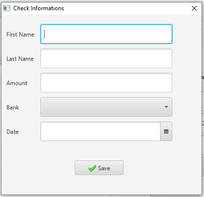

# store-management-javafx
Application desktop pour la gestion d'un magasin(java et javaFX).  
le projet se compose des modules suivants :  
-gestion des clients  
-gestion des produits  
-gestion des ventes  
-gesion des paiements  

